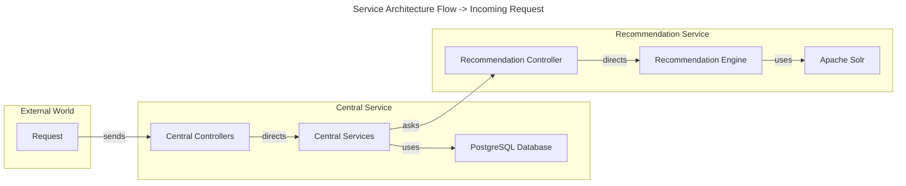
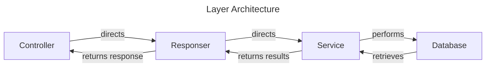
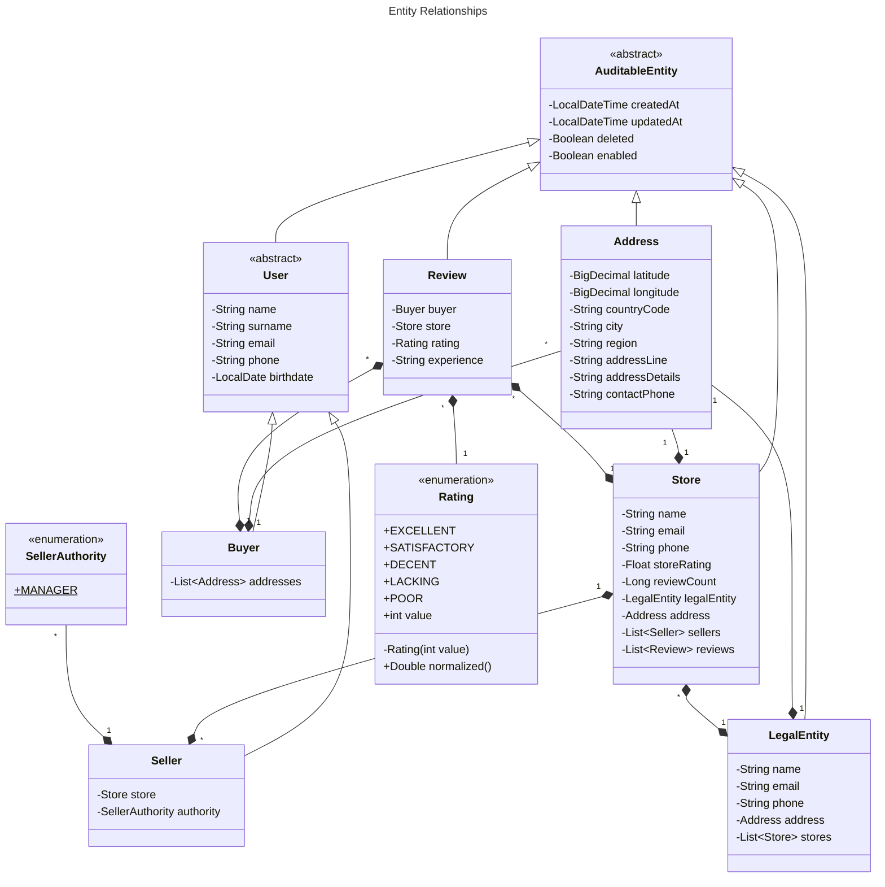

# ddd

Ding Dong Delicious (DDD) is a web app built with Java Spring Boot
that brings local restaurants together with customers looking for a delicious meal.

## Table of Contents

- [ddd](#ddd)
    - [Table of Contents](#table-of-contents)
    - [Versioning](#versioning)
    - [Diagrams and Relationships](#diagrams-and-relationships)

## Versioning

This project uses [AO-SemVer](https://github.com/alcheware/alpha-oriented-semantic-versioning) to format committing,
which is an extended version of Semantic Versioning (SemVer).

### Features

#### ~~f1: Allow auiditing for entities~~

~~1. Write "AuditableEntity" to be extended by all auditable entities~~

#### ~~f2: Represent an individual~~  

~~1. Write "User" to be extended by all individual types.~~  
~~2. Write "Buyer" to represent a customer.~~  
~~3. Write "Seller" to represent a any kind of seller.~~  
~~4. Write "SellerAuthority" to represent the roles a seller can have.~~    

#### ~~f3: Represent a store~~ 

~~1. A store must have a "LegalEntity", thus write "LegalEntity" to represent a legal entity.~~  
~~2. Write "Store" to represent stores.~~  
~~3. Write a StoreType enum to represent the type of store. Currently of no use, but for future scalability.~~    
~~4. A store must have Sellers to manage it. (bidirectional one to many)~~  

~~#### f4: Represent an address~~  

~~1. Write Address class, it can be owned => unidirectional relationship.~~    
~~2. Represent a collection of addresses with "AddressCollection" class.~~  
~~3. A buyer must have an "AddressCollection".  => currently unidirectional relationship to allow AddressCollection to be used by any entity.~~  
~~4. A store must have an "Address".~~  
~~5. A legal entity must have an "Address"~~    
~~6. Change address collection to be a list of addresses. Still address is not ownership of any relationships it has. But no more middle class anymore.~~

#### ~~f5: Represent a review~~ 

~~1. Write "Rating" to be used by "Review" to represent a rating.~~    
~~2. Write "Review" to represent a review.~~  
~~+3. Reviews should be owned by the store, as well.~~  

#### f6: Updatable store rating

1. Store rating should be updatable without going through the entire review list and rating again.

#### f7: Fundamental requests should be processable

> 1. Buyer controller is written.
> 2. Buyer service is written.
> 3. Buyer repository is written.
> 4. Buyer Response Dto(s) are written.
> 5. Buyer Request Dto(s) are written.
> 6. Buyer dto mapper(s) are written.

> 7. Store controller is written.
> 8. Store service is written.
> 9. Store repository is written.
> 10. Store Response Dto(s) are written.
> 11. Store Request Dto(s) are written.
> 12. Store dto mapper(s) are written.

> 13. Review controller is written.
> 14. Review service is written.
> 15. Review repository is written.
> 16. Review Response Dto(s) are written.
> 17. Review Request Dto(s) are written.
 
> ~~18. Address controller is written.~~  
> ~~19. Address service is written.~~  
> ~~20. Address repository is written.~~    
> ~~21. Address Response Dto(s) are written.~~  
> ~~22. Address Request Dto(s) are written.~~
> ~~23. Address coordinates retrieveing api is written.~~

#### f8: Services retrieve only active entities

~~1. Write a general specificiation to be used accross all services that will retrieve only active entities (An entity that is not deleted and is enabled.)~~  
2. Use the specification in all services.  
~~3. Services should be scalable to allow custom specifications to be used.~~  

#### ~~f9: Errors are handled~~  

~~1. Write custom exceptions that provides detailed information.~~  
~~2. Write a global exception handler, capture all custom exceptions and return a detailed error message.~~
 
#### ~~f10: Structured responses~~

~~1. Write a response structure.~~  
~~2. Write a response builder to build the response structure.~~  
~~3. Write a Tuple record that stores same type of two objects. Tuple should have a mapped function to map the objects to a new object. Main use scenario is update requests.~~

### Personal to-dos

> - [ ] Figure out a way to sync `store` data with Solr.  
> (Store service can, but is there a better way? Research DIH for newer versions of solar.)

## Diagrams and Relationships

### Architecture

Below is a summary of the service architecture flow for an incoming request.  

Service named "Central Service" is composed of multiple controllers and services
(like User controller, service and repository which uses PostgreSQL as its database).

The entire central service architecture is shown as if it is composed of a single service
for the sake of simplicity and purpose of this diagram.

### Layer Architecture

Below is a summary of the layer architecture of the service.

One thing different here is the Responser layer.
Responser is a class that is used to build a response.
- It acts as an abstraction of both the service and controller layer.
- It directs the request to the service, **untouched** as well.
- After service layer performs its actions, service layer returns results back to the responser, **untouched**.
- Responser maps the raw result to corresponding Dto objects, and wraps response structure around it.
- Lastly, it returns the response to the controller.

This helps to keep the service layer clean. Service layer does not need to know about the response structure. 

### Entity Relationships

## Certain design decisions

### Store data is shared between a Relational Database and Solr, why?

For the purpose of the tools. Relational database is used to store info of the store.
Solr is used to index the store related data, not data of the store, and provide search capabilities.

- Store object, at first, was designed to be an abstract class to hold the common fields of a store.

However, certain limitations prevented this approach. Thus, it was decided to use a single table for all store types.
Still, though, store types have their own service layers. Currently, there is only one store type, which is FoodStore.
But, it does not mean that the business will stay this way. It is possible that there will be more store types in the future.

#### But wouldn't it be complicated to store all store types in a single table, in the future?

In the future, store types can have their own tables. Such a refactoring can be handled as all store types will have their own services and layers.
But of course, this does not lower the complexity of the service layer.

To handle this, handwritten specifications will be used.
For example, for restaurant service, such a specification would help the service layer work on restaurants only, without explicitly stating that we want to work with restaurants only.