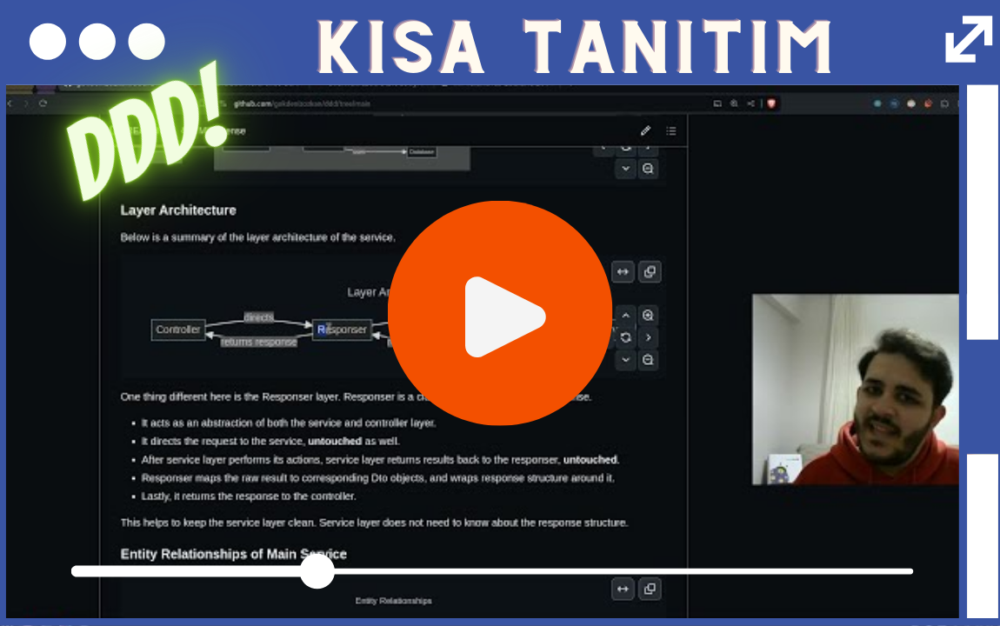
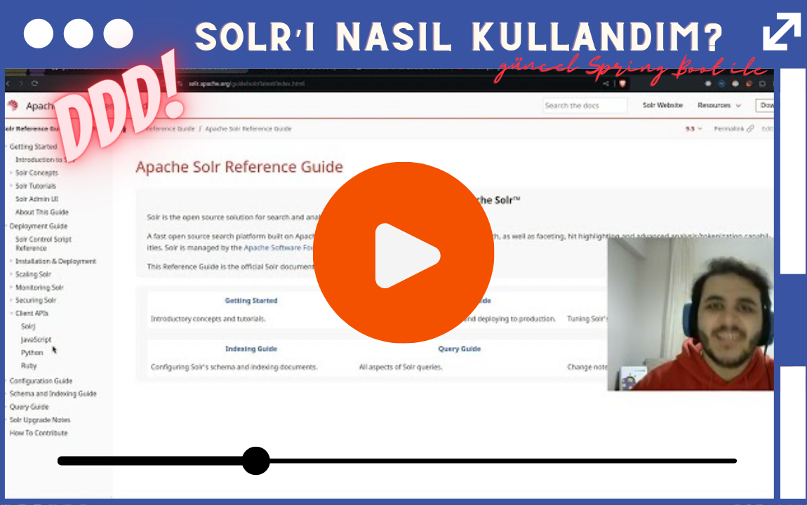
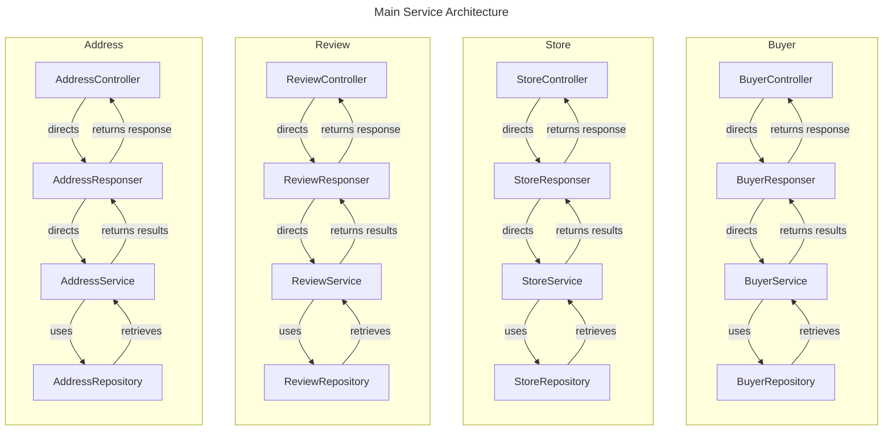
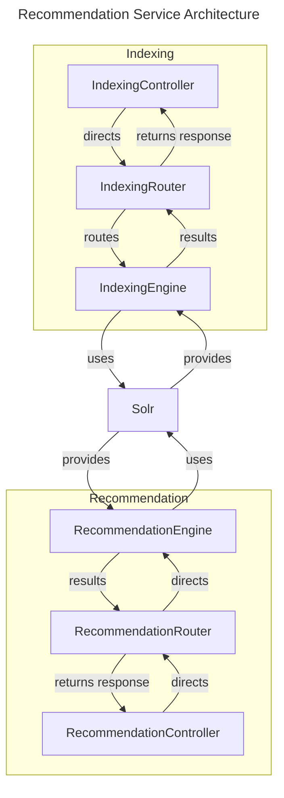
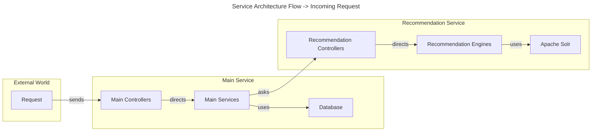
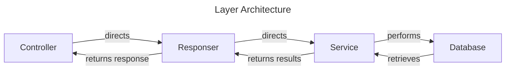

# ddd

Ding Dong Delicious (DDD) is a web app built with Java Spring Boot
that brings local restaurants together with customers looking for a delicious meal.

Watch my short introduction to the app: [https://youtu.be/dVnsUFvTigs](https://youtu.be/dVnsUFvTigs)  

Find more videos on the app at the [videos section](#videos)!
- [General Introduction](https://youtu.be/2rT5s5DAxls) to see how I designed the entire project, and see it in action.
- [Solr Usage](https://youtu.be/hs_AK3dZho4) to see how I was able to use Solr on newest versions of Spring Boot.
- [Unit and Integration Tests](https://youtu.be/SFoJJwOiLGU) to see how I was able to write tests for the app, and their results.

To test the app, go to `localhost:8080/swagger-ui.html` for Main Service, and `localhost:8081/swagger-ui.html` for Recommendation Service.

## Table of Contents

- [ddd](#ddd)
    - [Table of Contents](#table-of-contents)
    - [About DDD](#about-ddd)
    - [Versioning](#versioning)
    - [Videos](#videos)
    - [Installation](#installation)
    - [Diagrams and Relationships](#diagrams-and-relationships)
      - [Architecture](#architecture)
        - [Main service](#main-service)
        - [Recommendation service](#recommendation-service)
      - [Layer Architecture](#layer-architecture)
      - [Entity Relationships of Main Service](#entity-relationships-of-main-service)
    - [Certain design decisions](#certain-design-decisions)
      - [Store data is shared between a Relational Database and Solr, why?](#store-data-is-shared-between-a-relational-database-and-solr-why)
        - [But wouldn't it be complicated to store all store types in a single table, in the future?](#but-wouldnt-it-be-complicated-to-store-all-store-types-in-a-single-table-in-the-future)

## About DDD

**Things DDD stands out:**  
1. DDD uses Solr on Spring Boot's newest version, through the use of SolrJ API. See more information on the video [here](https://youtu.be/hs_AK3dZho4).
2. DDD uses DTO Projections to improve performance on certain data retrievals.
3. DDD uses Specifications to filter out active entities.
4. DDD uses Testcontainers to test the app.

**Qualities I presented while developing DDD:**
1. Diving deep into the raw documentations of new technologies.
2. Learning how to use new technologies in a very short time.
3. Writing clean, and maintainable code.
4. Developing re-usable structures that make the codebase more maintainable.
5. Passion for designing architectures, making them come to life, and seeing them work.
6. Enjoying the process of learning new things, and applying them to the project.

**Technologies used:**  
- Java 21
- Spring Boot 3.2.3 across all services
- Apache Solr 9.5.0 & SolrJ API
- PostgreSQL 16.2
- Testcontainers for testing

## Versioning

This project uses [AO-SemVer](https://github.com/alcheware/alpha-oriented-semantic-versioning) to format committing,
which is an extended version of Semantic Versioning (SemVer).

You may find the features use for versioning in the [VERSIONING-FEATURES.md](VERSIONING-FEATURES.md) file.

## Videos

## Installation

To install the app,
make sure you have Docker Engine and Docker Compose installed on your machine (or you can have Docker Desktop, which includes all).

If you prefer video guides, here is a YouTube video of mine: [https://youtu.be/UPQtShILJw0](https://youtu.be/UPQtShILJw0)

1. Clone this repo, or download the [compose.yaml](compose.yaml) file.
2. `cd` to the directory where `compose.yaml` file is located.
3. Open your favorite terminal and run `docker compose up`.
4. When pulling is done and docker containers are started, go to the [http://localhost:8983/solr](http://localhost:8983/solr) address on your browser.
5. This page is Solr's admin panel. Select the core named `dddfoodstores` from the menu located at the bottom of the left menu.
6. Navigate to the `Schema` section.
7. Add the following fields to the schema:
   - TYPE, FIELD NAME
   - string, name
   - location, latlon
   - pfloat, rating
   - string, latitude
   - string, longitude
8. When you add the fields stated above, you are done!
9. You may consider populating the database, and Solr with the [populate-db file](./main-service/http-starters/populate-db.http) found in the http-starters directory (in main-service).
10. That's it! You are ready to go. 

## Diagrams and Relationships

### Architecture

This app was written in a hybrid architecture, and has two services, one of which is the main service, and the other is the recommendation service.

#### Main service

Main service is written in monolithic architecture. It is composed of multiple controllers and services.
For more detailed information on how entities relate to each other, see [Entity Relationships](#entity-relationships).

#### Recommendation service

Recommendation service is written in microservice architecture in mind. It is a reactive service that uses Apache Solr to provide spatial recommendations.

### Incoming Request Flow

### Layer Architecture

Below is a summary of the layer architecture of the service.

One thing different here is the Responser layer.
Responser is a class that is used to build a response.
- It acts as an abstraction of both the service and controller layer.
- It directs the request to the service, **untouched** as well.
- After service layer performs its actions, service layer returns results back to the responser, **untouched**.
- Responser maps the raw result to corresponding Dto objects, and wraps response structure around it.
- Lastly, it returns the response to the controller.

This helps to keep the service layer clean. Service layer does not need to know about the response structure. 

### Entity Relationships of Main Service

## Certain design decisions

### Store data is shared between a Relational Database and Solr, why?

For the purpose of the tools. Relational database is used to store info of the store.
Solr is used to index the store related data, not data of the store, and provide search capabilities.

- Store object, at first, was designed to be an abstract class to hold the common fields of a store.

However, certain limitations prevented this approach. Thus, it was decided to use a single table for all store types.
Still, though, store types have their own service layers. Currently, there is only one store type, which is FoodStore.
But, it does not mean that the business will stay this way. It is possible that there will be more store types in the future.

#### But wouldn't it be complicated to store all store types in a single table, in the future?

In the future, store types can have their own tables. Such a refactoring can be handled as all store types will have their own services and layers.
But of course, this does not lower the complexity of the service layer.

To handle this, handwritten specifications are used.
For example, for food store service, such a specification would help the service layer work on active (both enabled and non-deleted) stores only, without explicitly stating that we want to work with active ones.

One disclaimer would be that, current service implementations focusing on active entities are designed to GET active results, but can still perform update, and patch operations on non-active entities. This is a design decision, and can be changed in the future.

