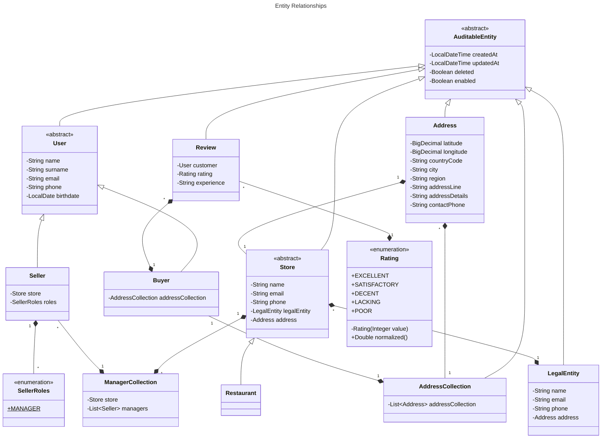

# ddd

Ding Dong Delicious (DDD) is a web app built with Java Spring Boot
that brings local restaurants together with customers looking for a delicious meal.

## Table of Contents

- [ddd](#ddd)
    - [Table of Contents](#table-of-contents)
    - [Versioning](#versioning)
    - [Diagrams and Relationships](#diagrams-and-relationships)

## Versioning

This project uses [AO-SemVer](https://github.com/alcheware/alpha-oriented-semantic-versioning) to format committing,
which is an extended version of Semantic Versioning (SemVer).

### Features

#### ~~f1: Allow auiditing for entities~~

~~1. Write "AuditableEntity" to be extended by all auditable entities~~

#### f2: Represent an individual

~~1. Write "User" to be extended by all individual types.~~  
~~2. Write "Buyer" to represent a customer.~~  
3. Write "Seller" to represent a any kind of seller.  
4. Write "SellerRoles" to represent the roles a seller can have.  

#### f3: Represent a store

1. A store must have a "LegalEntity", thus write "LegalEntity" to represent a legal entity.  
2. Write "Store" to be extended by all store types.  
3. Write "Restaurant" to represent a restaurant.  
4. Write "ManagerCollection" to represent the managers of a store. Store is the only owner, thus it is a unidirectional
   relationship.  

#### f4: Represent an address

~~1. Write Address class, it can be owned => unidirectional relationship.~~    
~~2. Represent a collection of addresses with "AddressCollection" class.~~  
3. A buyer must have an "AddressCollection".  
4. A store must have an "Address".  
5. A legal entity must have an "Address"  

#### f5: Represent a review

1. Write "Rating" to be used by "Review" to represent a rating.  
2. Write "Review" to represent a review.  

## Diagrams and Relationships

